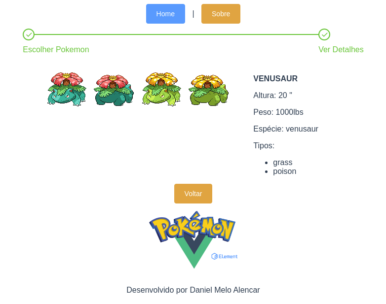

<p align="center">
  <a href="https://github.com/othneildrew/Best-README-Template">
    
  </a>

  <h3 align="center">VueJS PokeAPI Example</h3>

  <p align="center">
    An awesome README template to jumpstart your projects!
    <br />
    <a href="https://pokeapi.co/docs/v2"><strong>Explore the PokeApi docs »</strong></a>
    ·
    <a href="https://element.eleme.io/?ref=madewithvuejs.com#/en-US/component/installation"><strong>Explore the Element UI docs »</strong></a>
    ·
    <a href="https://vuejs.org/v2/guide/"><strong>Explore the VueJS docs »</strong></a>
    <br />
    <br />
    ·
    <a href="https://github.com/danielmeloalencar/vue-js-pokemon-api/issues">Report Bug</a>
    ·
    <a href="https://github.com/danielmeloalencar/vue-js-pokemon-api/issues">Request Feature</a>
  </p>
  

</p>


### Installation

1. Clone the repo
   ```sh
   git clone https://github.com/danielmeloalencar/vue-js-pokemon-api.git
   ```
2. Install NPM packages
   ```sh
   npm install
   ```
3. Run
   ```sh
   npm run serve
   ```
